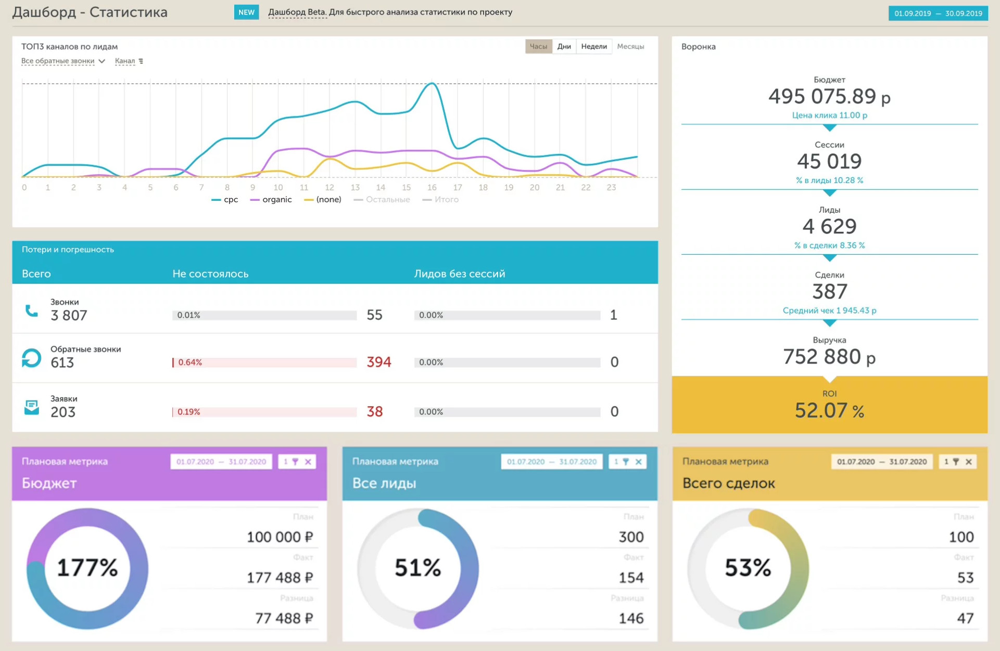

# Кейс 7. Построение дашборда в DataLens

  
<h3>📖 Условие кейса</h3>

  Инструменты `Business Intelligence (BI)` используются для принятия обоснованных решений на основе данных. Они помогают выявлять закономерности, тенденции и зависимости, которые могут быть неочевидны при анализе разрозненных данных. Это позволяет компаниям оптимизировать свою деятельность, повышать эффективность работы и улучшать качество предоставляемых услуг или товаров.

  `Дашборд` представляет собой интерактивные панели управления, на которых отображаются ключевые показатели эффективности (KPI) компании. С помощью дашбордов можно отслеживать такие метрики, как продажи, прибыль, затраты, клиентская база, удовлетворённость клиентов и другие важные показатели.

  
  
  BI-инструменты позволяют автоматизировать процесс сбора, обработки и анализа данных, что сокращает время на подготовку отчётов и упрощает работу аналитиков. Они также обеспечивают безопасность хранения данных и гарантируют их конфиденциальность.

 
  
<h3>📝 Практика</h3>

  
  1. Познакомиться с основными элементы BI-системы на примере [Yandex DataLens](https://yandex.cloud/ru/services/datalens). Для этого необходимо изучить гайд по основам DataLens с открытыми данными о продажах сети магазинов в Москве.
    
     * [Инструкция на Yandex Cloud](https://cloud.yandex.ru/ru/blog/posts/2022/06/yandex-datalens-sales-analysis)
     * [Инструкция на vc.ru](https://vc.ru/services/453689-kak-proanalizirovat-prodazhi-seti-magazinov-v-yandex-datalens-poshagovaya-instrukciya)

  2. Проанализировать данные о продажах дизайнерского бутика, построив дашборд со следующими графиками:

     * График динамики прибыли и добавьте линию средних расходов клиента (расчитать)
     * График продаж по категориям товаров
     * График "Топ 10 самых продаваемых товаров"
     * График распределения прибыли по магазинам и информацией о средних тратах клиента
     * Посчитать следующие метрики: выручка, средства на закупаемые товары, прибыль, маржинальность, количество клиентов, средние траты клиентов

 
  
<h3>❗ Задание</h3>

  
  1. Выберите задание [согласно вашему номеру](https://docs.google.com/spreadsheets/d/1NA14YElz6Jfmcqx8Wv3Jef1nThxuUeKgljbuVWBeqfk/edit?usp=sharing).

     * Задание 1. Avito.ru Соц.дем профиль посетителей сайта с Mobile устройств
     * Задание 2. Google.com Соц.дем профиль посетителей сайта с Desktop&Mobile устройств
     * Задание 3. Interfax.ru Соц.дем профиль посетителей сайта с Desktop устройств
     * Задание 4. Mail.ru Соц.дем профиль посетителей сайта с Mobile устройств
     * Задание 5. Vk.ru Соц.дем профиль посетителей сайта с Mobile устройств
     * Задание 6. Yandex.ru Соц.дем профиль посетителей сайта с Desktop&Mobile устройств
     * Задание 7: Youtube.com Соц.дем профиль посетителей сайта с Desktop устройств
  2. Данные представляют собой информацию о посещения различных платформ. Данные находятся в данные и подготовить по ним отчет:
  3. Создайте дашборд используя 4 датасета для каждого отдельного листа данных. ВНИМАНИЕ! на дашборде можно создавать вкладки для перехода по страницам.
  4. Опишите графики, которые позволят ответить на следующие вопросы:
     * Сколько пользователей по данным о поле и возрасте
     * Какое среднее количество пользователей в день?
     * Какое среднее число посетителей за последний месяц?
     * Сколько всего мужчин в исследовнии?
     * Сколько всего женщин в исследовнии?
     * Какова динамика появления новых пользователей по месяцам?
     * Как пользователи распределены по уровню дохода семьи
     * Как пользователи распределены по полу и возрасту?
     * Как пользователи распределены по роду занятий?
  5. [Прислать ссылку на дашборд преподавателю в форму](https://forms.yandex.ru/cloud/6743a2b102848f8620ee122d/)

